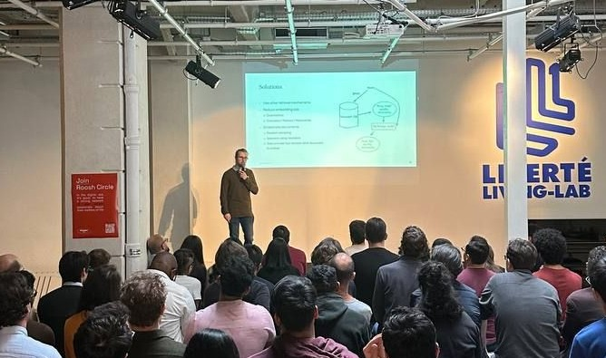

+++
title = 'AICamp 2024'
date = 2024-08-14T23:11:57+02:00
draft = false
+++

## Talk at Paris AICamp Meetup in April 2024

I had the opportunity to talk about my experience building and rnning in production a Retrieval Augmented Generation (RAG) model at Synthesio.

In my talk, rather on focusing on how to build such pipeline, I discussed the challenges to run it in production.

**For more detailled information, the slides of my talks are available [here](https://lgermain-pa-public-sharing.s3.fr-par.scw.cloud/retrieval_augmented_generation/rag_2024_05_01.pdf).**

## Challenges of a rag pipeline

Making a RAG pipeline in a notebook, with a small amount pf data is fairly easy, but running it in production is a whole different story.

The 2 main challenges are :
- Overcoming costs due to scaling
- Ensuring the quality of the generated content

### Retrieval

#### Cost of scaling

A typical retrieval augmented generation pipeline is composed of an embedding model and a vector database that serves as a search engine.

While being very cost effective at small scale, the costs of the retrieval part can quickly skyrocket when the number of documents to search in increases.

First the embedding model needs to be served and it need expensive GPUs to run. This implies having to rent a GPU instance on a cloud provider, which can be very expensive. Another solution can be to use an API, but this can also be very expensive and scales poorly.

Secondly, the vectors of all the chunks of text need to be stored in teh vector database. This is gonna be expansive as well, when scaling to dozend of millions, or billions of documents. In our case, adding a vector to a text nearly doubles the required storage (in bytes per document). This is gonna be a recurrent cost, as the vectors need to be stored over time.

At the end, the total cost of the retrieval part can be very high, in our case, it was around 100 000k€ per year. to store vectors for 100 billion documents.

#### Solutions

To overcome the cost of the retrieval part, we had to find a way to reduce the number of documents to embed and store.

Therefore, we decided to use a two step retrieval process. First, we use a simple keyword search to reduce the number of documents to embed. This functionnality is already implemented in most search engines, like Elasticsearch, so it's nearly free and requires almost no engineering effort. However, the quality of the retrieved documents is not very good, as it's based on the keywords, and not on the semantic of the text.

As a second step, we use a reranking model, that takes the top K documents from the keyword search, and rerank them thanks to a Cross-Encoder transformer model. Some exmaples of this model can be found on the [Sentence Transformers website](https://sbert.net/docs/cross_encoder/pretrained_models.html).

Cross encoders are very good at reranking documents because both the query and the passages are fed through the model, at the same time. Therefore the attention mechanism is applied to both the query and passage tokens, leading to a better reranking.

Since the number of documents to rerank is very low, the cost of the reranking part is very low, ans in out case the two step retrieval process performed as well, if not better than a single step retrieval process with semantic similarity.

We are working on including some semantic similaruty search in the first step since it deminstrated to be very efficient when cimbined with the reranking model. To overcome the cost of the storage, the solution is to reduce the number of documents to embed. And several approaches can be used:

- Naive approach: Use random sampling.
- Heuristics-based methods: Define some rules to decide wether or not to embed a document like length of text, number of named entities.
- Machine learning based: We train a small model tht decides wather or not a document should be embedded. It could be seen as a measure of the "informativeness" of a document.

### Generation

The corst for generation are pretti straightforward. There are two approaches:

- Use a cloud provider API: This is the easiest way to generate text, but it's also the most expensive. The cost of generating text vary depending on the model and the provider, but it has the advantage to scale to 0 when not used. However, the cost can be very high when the model is used a lot.

- Use a GPU instance and a open source model: This is the cheapest way to generate text when used at large scale. While it requires an significant engineering effort to deploy and to pay for the GPU instances, the cost of generating text is very low and scaled way better.

At some point, it becomes more cost effective to use an open source model and a GPU instance, rather than a cloud provider API. As described in the graĥics in the slides.

### Quality and structure of the generated content

#### Metrics

Ensuring the quality of the generated content is a whole different story. The quality of the generated content is very important, as it's the main output of the RAG pipeline.

Measuring how well the pipeline works is a vast and complex subject and will be discussed in a future blog post.
To be quick, a RAG pipeline is evaluated in severalk ways:
- Retrieval quality: how well the documents are retrieved, we measure precision and recall for the retrieved documents.
- Generation quality: the model generates one or more elements of answer, we measure how well the model used the context passed to the documents to generate the answer. We measure faithfulness, it could be seen as a hallucination rate. We also measure is the answer correspinds to the query.

#### Structured outputs

Now lets consider an deployed application inside a platform. The generated content needs to be structured in a way that the platform can understand and use it.

Usually it can be JSON, yaml, Markdown, or any other structured format. Many times, the model can struggle to generate a corerct output (that we can parse) or to generate an output that does not follow the desired schema.

Solving this goes into 2 main parts:
-  Go through extensive prompt engineering to guide the model to generate the correct output as much as possible. This can be very painful and time consuming. Most probably, you'll have to re-do the prompt engineering when swiching between models / providers.
- Use a fault-tolerent post-processing system that can correct the output of the model.

These 2 parts, when used together can ensure the maximum success rate of the RAG pipeline.

## Conclusion

Running a RAG pipeline in production is a very challenging task. It requires a lot of engineering effort, to reduce costs and guarantee the quality of the generated content.

Also, a last point that I did not mention is the speed of the pipeline, some applications require the pipeline to be very fast, and this can be a challenge as well, adding more and more complexity to the pipeline imprived the results, but also slow down the pipeline.

_More details about the challenges of running a RAG pipeline in production can be found in the slides of my talk [here](https://lgermain-pa-public-sharing.s3.fr-par.scw.cloud/retrieval_augmented_generation/rag_2024_05_01.pdf).
Don't hesitate to reach out to meon linkedin or by email._